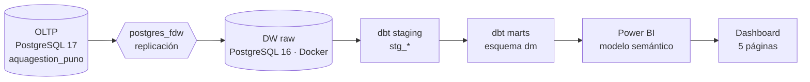

# Arquitectura BI

La solución sigue una arquitectura por capas que separa el origen transaccional, la
replicación, el almacén analítico, la transformación y el consumo.

## Diagrama de flujo

## Capas (arquitectura Medallion)

| Capa | Equivalencia | Propósito |
| --- | --- | --- |
| `raw` | Bronze | Réplica del OLTP en el DW mediante tablas foráneas (postgres_fdw). |
| `staging` | Silver | Modelos dbt `stg_*`: limpieza, tipado y estandarización. |
| `marts` (`dm`) | Gold | Dimensiones y hecho del esquema en estrella, listos para análisis. |

## Componentes y puertos

| Componente | Tecnología | Puerto | Ubicación |
| --- | --- | --- | --- |
| OLTP | PostgreSQL 17 | `5432` | Host (Windows) |
| Data Warehouse | PostgreSQL 16 | `15432` | Contenedor Docker |
| Transformación | dbt Core 1.7.18 | — | Contenedor Docker |
| Visualización | Power BI Desktop | — | Host (Windows) |

!!! warning "Docker y networking"
    Dentro de un contenedor, `localhost` se refiere **al propio contenedor**. Para que
    `postgres_fdw` (que corre en el DW dockerizado) alcance el OLTP del host de Windows,
    debe usar **`host.docker.internal`** o la IP de la LAN del host, nunca `localhost`.

!!! note "Sobre la ingesta"
    Se intentó usar **Airbyte**, pero las versiones 0.50.11 y 0.50.33 resultaron
    incompatibles con Docker Desktop sobre Windows. La replicación se resolvió con
    **postgres_fdw**, que cumple la misma función de mover los datos hacia el DW.
