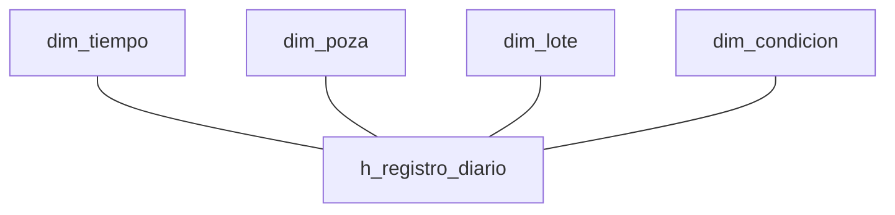

# 5. Modelo dimensional (Data Mart)

## Objetivo

Definir el esquema en estrella del esquema `dm`: cuatro dimensiones y una tabla de hechos
con grano diario.

## Esquema en estrella



| Tabla | Tipo | Clave | KPI que soporta |
| --- | --- | --- | --- |
| `dim_tiempo` | Dimensión | `sk_fecha` (CHAR(8)) | Todos (eje temporal) |
| `dim_poza` | Dimensión (SCD Tipo 1) | `sk_poza` | Total Bajas, Temperatura |
| `dim_lote` | Dimensión | `sk_lote` | Tasa de Mortalidad |
| `dim_condicion` | Dimensión | `sk_condicion` | Tasa de Mortalidad |
| `h_registro_diario` | Hecho | `(sk_fecha, sk_poza, sk_lote)` | Todos |

## Decisiones de diseño

- **Grano del hecho**: un registro por **día, por poza y por lote**.
- **Claves subrogadas**: `dim_tiempo` usa una clave `CHAR(8)` en formato `YYYYMMDD`.
- **Unicidad del grano**: restricción `UNIQUE` compuesta sobre `(sk_fecha, sk_poza, sk_lote)`.
- **SCD Tipo 1** en `dim_poza`: los cambios de atributo sobrescriben el valor anterior.
- **Índices de rendimiento** sobre las claves subrogadas del hecho.

## dim_tiempo

!!! tip "Cubrir todo el rango"
    `dim_tiempo` debe cubrir el rango completo **2024–2025** sin huecos. Una columna
    `fecha` de tipo *Date* real (además de la clave `CHAR(8)`) es **indispensable** para la
    inteligencia de tiempo en Power BI.

```sql
-- Clave subrogada en formato YYYYMMDD
SELECT TO_CHAR(d, 'YYYYMMDD')::char(8) AS sk_fecha,
       d::date                         AS fecha,
       EXTRACT(YEAR  FROM d)::int       AS anio,
       EXTRACT(MONTH FROM d)::int       AS mes,
       EXTRACT(DAY   FROM d)::int       AS dia
FROM generate_series('2024-01-01'::date, '2025-12-31'::date, '1 day') AS d;
```

## Verificación

```sql
-- El grano no debe tener duplicados
SELECT sk_fecha, sk_poza, sk_lote, COUNT(*)
FROM dm.h_registro_diario
GROUP BY 1,2,3 HAVING COUNT(*) > 1;   -- debe devolver 0 filas
```

!!! success "Evidencia para el informe"
    Captura el diagrama del modelo estrella y la consulta de unicidad del grano (0 filas).
