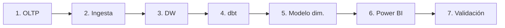

# Guías de construcción

Estas guías explican **cómo construir cada componente** del entregable, en el orden
recomendado. Cada una incluye objetivo, pasos, verificación y la evidencia que conviene
capturar para el informe.

1. [OLTP (PostgreSQL 17)](01-oltp-postgres.md) — la base transaccional.
2. [Ingesta (postgres_fdw)](02-ingesta-fdw.md) — replicación hacia el DW.
3. [Data Warehouse (Docker)](03-data-warehouse.md) — almacén analítico.
4. [Transformación (dbt)](04-dbt.md) — staging y marts.
5. [Modelo dimensional](05-modelo-dimensional.md) — esquema en estrella.
6. [Power BI](06-powerbi.md) — modelo semántico y dashboard.
7. [Validación de KPIs](07-validacion.md) — conciliación SQL vs Power BI.

